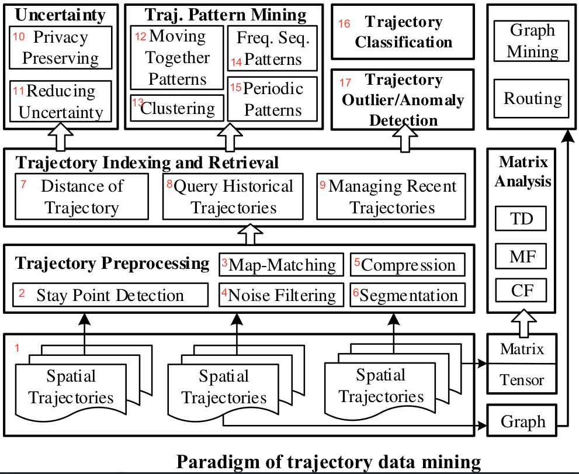

# Use PyMove and go much further

---

## Information

<table>
<tr>
  <td>Package Status</td>
  <td>
    <a href="https://pypi.org/project/pymove/">
      
    </a>
  </td>
</tr>
<tr>
  <td>License</td>
  <td>
    <a href="https://github.com/InsightLab/PyMove/blob/master/LICENSE">
      
    </a>
</td>
</tr>
<tr>
  <td>Python Version</td>
  <td>
    <a href="https://www.python.org/doc/versions/">
      
    </a>
</td>
</tr>
<tr>
  <td>Platforms</td>
  <td>
    <a href="https://anaconda.org/conda-forge/pymove">
      
    </a>
  </td>
</tr>
<tr>
  <td>All Platforms</td>
  <td>
    <a href="https://dev.azure.com/conda-forge/feedstock-builds/_build/latest?definitionId=9753&branchName=master">
      
    </a>
  </td>
</tr>
<tr>
  <td>PyPi Downloads</td>
  <td>
    <a href="https://pypi.org/project/pymove/#files" alt="PyPi downloads">
      
    </a>
  </td>
</tr>
<tr>
  <td>PyPi version</td>
  <td>
    <a href="https://pypi.org/project/pymove/#history" alt="PyPi version">
      
    </a>
  </td>
</tr>
<tr>
  <td>Conda Downloads</td>
  <td>
    <a href="https://anaconda.org/conda-forge/pymove">
      
    </a>
  </td>
</tr>
<tr>
  <td>Conda version</td>
  <td>
    <a href="https://anaconda.org/conda-forge/pymove">
      
    </a>
  </td>
</tr>
<tr>
  <td>Stars</td>
  <td>
    <a href="https://github.com/InsightLab/PyMove/stargazers">
      
    </a>
  </td>
</tr>
<tr>
  <td>Forks</td>
  <td>
    <a href="https://github.com/InsightLab/PyMove/network/members">
      
    </a>
  </td>
</tr>
<tr>
  <td>Issues</td>
  <td>
    <a href="https://github.com/InsightLab/PyMove/issues">
      
    </a>
  </td>
</tr>
<tr>
  <td>Code Quality</td>
  <td>
    <a href="https://www.codacy.com/gh/InsightLab/PyMove?utm_source=github.com&amp;utm_medium=referral&amp;utm_content=InsightLab/PyMove&amp;utm_campaign=Badge_Grade">
      
    </a>
  </td>
</tr>
<tr>
  <td>Code Coverage</td>
  <td>
    <a href="https://www.codacy.com/gh/InsightLab/PyMove?utm_source=github.com&utm_medium=referral&utm_content=InsightLab/PyMove&utm_campaign=Badge_Coverage">
      
    </a>
  </td>
</tr>
</table>

---

## What is PyMove

PyMove is a Python library for processing and visualization
 of trajectories and other spatial-temporal data.

We will also release wrappers to some useful Java libraries
 frequently used in the mobility domain.

Read the full documentation on [ReadTheDocs](https://pymove.readthedocs.io/en/latest/)

---

## Main Features

PyMove **proposes**:

-   A familiar and similar syntax to Pandas;

-   Clear documentation;

-   Extensibility, since you can implement your main data structure by
 manipulating other data structures such as
 Dask DataFrame, numpy arrays, etc., in addition to adding new modules;

-   Flexibility, as the user can switch between different data structures;

-   Operations for data preprocessing, pattern mining and data visualization.

---

## Creating a Virtual Environment

It is recommended to create a virtual environment to use pymove.

Requirements: Anaconda Python distribution installed and accessible

1.  In the terminal client enter the following where `env_name` is the name
 you want to call your environment, and replace `x.x` with the Python version
 you wish to use. (To see a list of available python versions first,
 type conda search "^python$" and press enter.)
    -   ``conda create -n <env_name> python=x.x``

    -   `Press y to proceed. This will install the Python version and all the`
 associated anaconda packaged libraries at `path_to_your_anaconda_location/anaconda/envs/env_name`

2.  Activate your virtual environment. To activate or switch into your
 virtual environment, simply type the following where yourenvname is the
 name you gave to your environment at creation.
    -   ``conda activate <env_name>``

3.  Now install the package from either `conda`, `pip` or `github`

---

## [Conda](https://anaconda.org/conda-forge/pymove) instalation

1.  `conda install -c conda-forge pymove`

## [Pip](https://pypi.org/project/pymove) installation

1.  `pip install pymove`

---

## [Github](https://github.com/InsightLab/PyMove) installation

1.  Clone this repository
    -   ``git clone https://github.com/InsightLab/PyMove``

2.  Switch to folder PyMove
    -   ``cd PyMove``

3.  Switch to a new branch
    -   ``git checkout -b developer``

4.  Make a pull of branch
    -   ``git pull origin developer``

5.  Install pymove in developer mode
    -   ``make dev``

### For windows users

If you installed from `pip` or `github`, you may encounter an error related to
 `shapely` due to some dll dependencies. To fix this, run `conda install shapely`.

---

## Examples

You can see examples of how to use PyMove [here](https://github.com/InsightLab/PyMove/tree/master/notebooks)

---

## Mapping PyMove methods with the Paradigms of Trajectory Data Mining


[ZHENG 2015](https://www.microsoft.com/en-us/research/publication/trajectory-data-mining-an-overview/).

-   1: **Spatial Trajectories** &rarr; `pymove.core`
    -   `MoveDataFrame`
    -   `DiscreteMoveDataFrame`

-   2: **Stay Point Detection** &rarr; `pymove.preprocessing.stay_point_detection`
    -   `create_or_update_move_stop_by_dist_time`
    -   `create_or_update_move_and_stop_by_radius`

-   3: **Map-Matching** &rarr; `pymove-osmnx`

-   4: **Noise Filtering** &rarr; `pymove.preprocessing.filters`
    -   `by_bbox`
    -   `by_datetime`
    -   `by_label`
    -   `by_id`
    -   `by_tid`
    -   `clean_consecutive_duplicates`
    -   `clean_gps_jumps_by_distance`
    -   `clean_gps_nearby_points_by_distances`
    -   `clean_gps_nearby_points_by_speed`
    -   `clean_gps_speed_max_radius`
    -   `clean_trajectories_with_few_points`
    -   `clean_trajectories_short_and_few_points`
    -   `clean_id_by_time_max`

-   5: **Compression** &rarr; `pymove.preprocessing.compression`
    -   `compress_segment_stop_to_point`

-   6: **Segmentation** &rarr; `pymove.preprocessing.segmentation`
    -   `bbox_split`
    -   `by_dist_time_speed`
    -   `by_max_dist`
    -   `by_max_time`
    -   `by_max_speed`

-   7: **Distance Measures** &rarr; `pymove.distance`
    -   `medp
    -   `medt`
    -   `euclidean_distance_in_meters`
    -   `haversine`

-   8: **Query Historical Trajectories** &rarr; `pymove.query.query`
    -   `range_query`
    -   `knn_query`

-   9: **Managing Recent Trajectories**

-   10: **Privacy Preserving**

-   11: **Reducing Uncertainty**

-   12: **Moving Together Patterns**

-   13: **Clustering** &rarr; `pymove.models.pattern_mining.clustering`
    -   `elbow_method`
    -   `gap_statistics`
    -   `dbscan_clustering`

-   14: **Freq. Seq. Patterns**

-   15: **Periodic Patterns**

-   16: **Trajectory Classification**

-   17: **Trajectory Outlier / Anomaly Detection** &rarr; `pymove.semantic.semantic`
    -   `outliers`
    -   `create_or_update_out_of_the_bbox`
    -   `create_or_update_gps_deactivated_signal`
    -   `create_or_update_gps_jump`
    -   `create_or_update_short_trajectory`
    -   `create_or_update_gps_block_signal`
    -   `filter_block_signal_by_repeated_amount_of_points`
    -   `filter_block_signal_by_time`
    -   `filter_longer_time_to_stop_segment_by_id`

---

## Cite

The library was originally created during the bachelor's thesis of 2 students from the Federal University of Ceará, so you can cite using both works.

```txt
@mastersthesis{arina2019,
	title        = {Uma Arquitetura E Implementação Do Módulo De Pré-processamento Para Biblioteca Pymove},
	author       = {Arina De Jesus Amador Monteiro Sanches},
	year         = 2019,
	school       = {Universidade Federal Do Ceará},
	type         = {Bachelor's thesis}
}
@mastersthesis{andreza2019,
	title        = {Uma Arquitetura E Implementação Do Módulo De Visualizaçãopara Biblioteca Pymove},
	author       = {Andreza Fernandes De Oliveira},
	year         = 2019,
	school       = {Universidade Federal Do Ceará},
	type         = {Bachelor's thesis}
}
```

---

## Publications

-   [Uma Arquitetura E Implementação Do Módulo De Pré-processamento Para Biblioteca Pymove](http://repositorio.ufc.br/handle/riufc/58551)
-   [Uma Arquitetura E Implementação Do Módulo De Visualizaçãopara Biblioteca Pymove](http://repositorio.ufc.br/handle/riufc/58550)

---

## Useful list of related libraries and links

-   [Handling GPS Data with Python](https://github.com/FlorianWilhelm/gps_data_with_python/tree/master/notebooks)
-   [mplleaflet - Easily convert matplotlib plots from Python into interactive Leaflet web maps](https://github.com/jwass/mplleaflet)
-   [Pykalman](https://github.com/pykalman/pykalman)
-   [Ramer-Douglas-Peucker algorithm](https://github.com/fhirschmann/rdp)
-   [Knee point detection in Python](https://github.com/arvkevi/kneed)
-   [TrajSuite Java Library](https://github.com/lukehb/TrajSuite)
-   [GraphHopper Map-Matching Java Library](https://github.com/graphhopper/map-matching)
