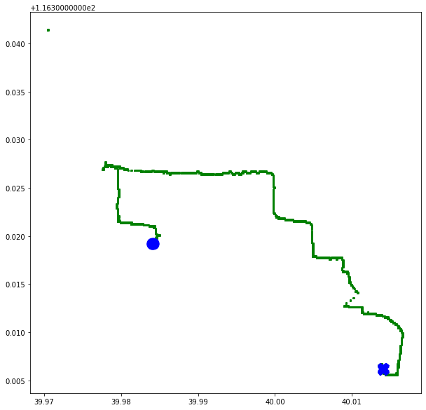

04 - Exploring Grid
===================

In trajectories data mining process, there is a need frequent acess
differents segments and samples of trajectories. With big volume data,
those acesses can need time and processing. With this, it’s necessary to
adopt effective techniques to management and handling of this data,
allowed fast recovery of data.

One approach to this technique takes geographic space into account,
dividing it into grids, the so-called **grids**, and **creating a time
index for the trajectories that fall into each cell of this grid**.
**Each segment** that falls into a grid **is represented by a point with
coordinates equal to the start time point and the end time point of the
segment**.

In PyMove, grids are delimited by coordinates in a cartesian plan based
tracing in bound box of data. Grids are represented by objects that have
those attributes:

-  **lon_min_x:** minimum longitude.
-  **lat_min_y:** minimum latitude.
-  **grid_size_lat_y:** grid latitude size.
-  **grid_size_lon_x:** grid longitude size.
-  **cell_size_by_degree:** cell size of Grid.

Imports
-------

.. code:: ipython3

    from pymove import read_csv
    from pymove.core.grid import Grid

Load data
---------

.. code:: ipython3

    df = read_csv('geolife_sample.csv', parse_dates=['datetime'])
    data = df[:1000]
    data

.. raw:: html

    

    
    <table border="1" class="dataframe">
      <thead>
        <tr style="text-align: right;">
          <th></th>
          <th>lat</th>
          <th>lon</th>
          <th>datetime</th>
          <th>id</th>
        </tr>
      </thead>
      <tbody>
        <tr>
          <th>0</th>
          <td>39.984094</td>
          <td>116.319236</td>
          <td>2008-10-23 05:53:05</td>
          <td>1</td>
        </tr>
        <tr>
          <th>1</th>
          <td>39.984198</td>
          <td>116.319322</td>
          <td>2008-10-23 05:53:06</td>
          <td>1</td>
        </tr>
        <tr>
          <th>2</th>
          <td>39.984224</td>
          <td>116.319402</td>
          <td>2008-10-23 05:53:11</td>
          <td>1</td>
        </tr>
        <tr>
          <th>3</th>
          <td>39.984211</td>
          <td>116.319389</td>
          <td>2008-10-23 05:53:16</td>
          <td>1</td>
        </tr>
        <tr>
          <th>4</th>
          <td>39.984217</td>
          <td>116.319422</td>
          <td>2008-10-23 05:53:21</td>
          <td>1</td>
        </tr>
        <tr>
          <th>...</th>
          <td>...</td>
          <td>...</td>
          <td>...</td>
          <td>...</td>
        </tr>
        <tr>
          <th>995</th>
          <td>40.013765</td>
          <td>116.306468</td>
          <td>2008-10-23 23:43:31</td>
          <td>1</td>
        </tr>
        <tr>
          <th>996</th>
          <td>40.013828</td>
          <td>116.306413</td>
          <td>2008-10-23 23:43:36</td>
          <td>1</td>
        </tr>
        <tr>
          <th>997</th>
          <td>40.013905</td>
          <td>116.306365</td>
          <td>2008-10-23 23:43:41</td>
          <td>1</td>
        </tr>
        <tr>
          <th>998</th>
          <td>40.013992</td>
          <td>116.306323</td>
          <td>2008-10-23 23:43:46</td>
          <td>1</td>
        </tr>
        <tr>
          <th>999</th>
          <td>40.014089</td>
          <td>116.306264</td>
          <td>2008-10-23 23:43:51</td>
          <td>1</td>
        </tr>
      </tbody>
    </table>
    
1000 rows × 4 columns

    

Create virtual Grid
-------------------

.. code:: ipython3

    grid = Grid(data, 15)

.. code:: ipython3

    grid.get_grid()

.. parsed-literal::

    {'lon_min_x': 116.305468,
     'lat_min_y': 39.970511,
     'grid_size_lat_y': 341,
     'grid_size_lon_x': 266,
     'cell_size_by_degree': 0.00013533905150922183}

Create one polygon to point on grid
-----------------------------------

.. code:: ipython3

    print(grid.create_one_polygon_to_point_on_grid(2, 1))

.. parsed-literal::

    POLYGON ((116.3056033390515 39.97078167810302, 116.3056033390515 39.97091701715453, 116.305738678103 39.97091701715453, 116.305738678103 39.97078167810302, 116.3056033390515 39.97078167810302))

Create or update index grid feature
-----------------------------------

.. code:: ipython3

    grid.create_update_index_grid_feature(data)

.. code:: ipython3

    data.head()

.. raw:: html

    

    
    <table border="1" class="dataframe">
      <thead>
        <tr style="text-align: right;">
          <th></th>
          <th>lat</th>
          <th>lon</th>
          <th>datetime</th>
          <th>id</th>
          <th>index_grid</th>
        </tr>
      </thead>
      <tbody>
        <tr>
          <th>0</th>
          <td>39.984094</td>
          <td>116.319236</td>
          <td>2008-10-23 05:53:05</td>
          <td>1</td>
          <td>34541</td>
        </tr>
        <tr>
          <th>1</th>
          <td>39.984198</td>
          <td>116.319322</td>
          <td>2008-10-23 05:53:06</td>
          <td>1</td>
          <td>34883</td>
        </tr>
        <tr>
          <th>2</th>
          <td>39.984224</td>
          <td>116.319402</td>
          <td>2008-10-23 05:53:11</td>
          <td>1</td>
          <td>34883</td>
        </tr>
        <tr>
          <th>3</th>
          <td>39.984211</td>
          <td>116.319389</td>
          <td>2008-10-23 05:53:16</td>
          <td>1</td>
          <td>34883</td>
        </tr>
        <tr>
          <th>4</th>
          <td>39.984217</td>
          <td>116.319422</td>
          <td>2008-10-23 05:53:21</td>
          <td>1</td>
          <td>35224</td>
        </tr>
      </tbody>
    </table>
    

Create all polygons to all point on grid
----------------------------------------

.. code:: ipython3

    grid_data = grid.create_all_polygons_to_all_point_on_grid(data)

.. code:: ipython3

    grid_data.head()

.. raw:: html

    

    
    <table border="1" class="dataframe">
      <thead>
        <tr style="text-align: right;">
          <th></th>
          <th>id</th>
          <th>index_grid_lat</th>
          <th>index_grid_lon</th>
          <th>polygon</th>
        </tr>
      </thead>
      <tbody>
        <tr>
          <th>0</th>
          <td>1</td>
          <td>100</td>
          <td>101</td>
          <td>POLYGON ((116.3191372442024 39.98404490515092,...</td>
        </tr>
        <tr>
          <th>1</th>
          <td>1</td>
          <td>101</td>
          <td>102</td>
          <td>POLYGON ((116.3192725832539 39.98418024420243,...</td>
        </tr>
        <tr>
          <th>4</th>
          <td>1</td>
          <td>101</td>
          <td>103</td>
          <td>POLYGON ((116.3194079223055 39.98418024420243,...</td>
        </tr>
        <tr>
          <th>5</th>
          <td>1</td>
          <td>104</td>
          <td>106</td>
          <td>POLYGON ((116.31981393946 39.98458626135696, 1...</td>
        </tr>
        <tr>
          <th>6</th>
          <td>1</td>
          <td>104</td>
          <td>105</td>
          <td>POLYGON ((116.3196786004085 39.98458626135696,...</td>
        </tr>
      </tbody>
    </table>
    

Create all polygons on grid
---------------------------

.. code:: ipython3

    grid.create_all_polygons_on_grid()

.. parsed-literal::

    VBox(children=(HTML(value=''), IntProgress(value=0, max=341)))

.. code:: ipython3

    (grid.grid_polygon).shape

.. parsed-literal::

    (341, 266)

Get point to index grid
-----------------------

.. code:: ipython3

    grid.point_to_index_grid(39.984094, 116.319236)

.. parsed-literal::

    (100.0, 101.0)

Save grid to .pkl
-----------------

.. code:: ipython3

    grid.save_grid_pkl('teste.pkl')

Read .pkl to grid
-----------------

.. code:: ipython3

    grid.read_grid_pkl('teste.pkl').get_grid()

.. parsed-literal::

    {'lon_min_x': 116.305468,
     'lat_min_y': 39.970511,
     'grid_size_lat_y': 341,
     'grid_size_lon_x': 266,
     'cell_size_by_degree': 0.00013533905150922183}

Show a grid polygons
--------------------

.. code:: ipython3

    from pymove.visualization.matplotlib import plot_grid_polygons

.. code:: ipython3

    plot_grid_polygons(grid_data, return_fig=False)

